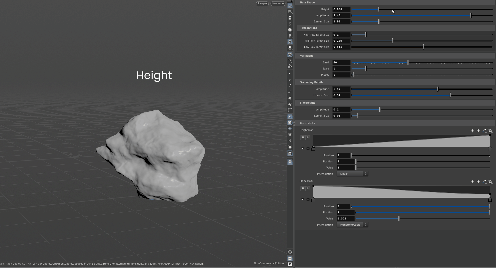

# Procedural Rock Generator

## Quick Start

1. Install the HDA.
2. Place the HDA in a Geometry network.
3. Adjust Height and Primary Noise parameters.
4. Change Seed to generate new rock variations.
5. Select one of the three output connectors (low_poly, mid_poly, or high_poly) using a "null SOP" and export the desired mesh.

## Introduction

Procedural Rock Generator is a Houdini Digital Asset (HDA) designed to create procedural rock variations through a parameter-driven workflow.

The tool generates unique rock meshes by combining procedural noise deformation, procedural masking, and fracture operations while maintaining artist control over the overall rock silhouette.

The HDA produces three separate mesh outputs with different polygon densities.

## Design Goals

- Produce believable procedural rock silhouettes.
- Maintain artist control through exposed parameters.
- Generate multiple reusable rock variations.
- Support procedural environment workflows.

## Problem Statement

Creating large numbers of natural-looking rock variations for large-scale environments requires manually modeling each asset. This process is time-consuming and increases production effort when a high level of variation is needed.

## Solution

The Procedural Rock Generator provides a parameter-driven workflow for creating procedural rock variations. Users can generate multiple unique rock forms by adjusting generation parameters and seed values without manually creating each asset.

## Features

### Procedural Generation

Generates rock variations through a parameter-driven procedural workflow.

### Seed-Driven Variation

Controls procedural variation for both procedural noise and fracture generation.

### Primary Shape Deformation

Controls the overall rock silhouette through the Primary Noise stage.

### Secondary Surface Detail

Adds medium-scale surface variation through the Secondary Noise stage.

### Fine Surface Detail

Adds fine-scale surface variation through the Detail Noise stage.

### Procedural Mask Generation

Provides height- and slope-based mask controls for influencing surface variation.

**See:** [Workflow → Mask Computation](#mask-computation)

### Curve-Based Mask Remapping

Provides user-controlled curve remapping for procedural mask influence.

**See:** [Workflow → Mask Computation](#mask-computation)

### Multiple Mesh Outputs

Provides three mesh outputs with different polygon densities.

**See:** [Outputs → Mesh Outputs](#mesh-outputs-1)

### Height Control

Controls the height of the base shape used to generate the rock.

### Scale Control

Controls the overall scale of the generated rock.

### Fracture Piece Control

Controls the number of fracture pieces generated during the fracture stage.

**See:** [Generation Process → Fracture](#fracture-1)

## Workflow

The **Procedural Rock Generator** follows a sequential procedural pipeline:

**Base Shape → Primary Noise → Fracture → Reconstruction → Mask Computation → Secondary Noise → Detail Noise → Mesh Outputs**

### Base Shape

Initializes the base geometry used as the foundation for the rock generation process.

### Primary Noise

Defines the overall rock silhouette through the primary shape generation stage.

### Fracture

Separates the generated rock into fracture pieces.

### Reconstruction

Repositions the fractured pieces into a unified rock form before subsequent surface detail is applied.

### Mask Computation

Generates the masks used to control subsequent detail generation.

### Secondary Noise

Applies the secondary surface variation stage.

### Detail Noise

Applies the final surface detail stage.

### Mesh Outputs

Produces the generated rock mesh outputs.

**See:** [Outputs → Mesh Outputs](#mesh-outputs-1)

## Installation

Follow the steps below to install the **Procedural Rock Generator** Houdini Digital Asset (HDA).

### Install the Asset Library

#### 1. Open the Installation Menu

In Houdini, navigate to:

**Assets → Install Asset Library...**

Alternatively, use:

**File → Import → Houdini Digital Asset**

#### 2. Locate the HDA File

Click the file browser icon next to the **Digital Asset Library** field.

Navigate to the downloaded .hdanc file location and select the asset file.

**Note:** The .hdanc format is a non-commercial Houdini Digital Asset format created using Houdini Apprentice.

#### 3. Choose the Installation Scope

Select the desired availability scope for the asset:

- **Current HIP File Only**
  The asset is available only within the current Houdini project file.
- **Scanned Asset Library Directories**
  The asset remains available across multiple project files during the active Houdini session.

#### 4. Install and Instantiate

Click **Install** to complete the asset installation.

To automatically create an instance of the asset in the current network graph after installation, select **Install and Create**.

## Requirements

- **Houdini License:** Houdini Apprentice or higher
- **Houdini Version:** Houdini FX 20.0.547

## Inputs

### Input Geometry

The **Procedural Rock Generator** does not require input geometry.

The HDA generates the rock geometry from its internal base shape and parameter settings.

## Outputs

### Mesh Outputs

The Procedural Rock Generator provides three HDA output connectors, each exposing a mesh with a different polygon density.

Output connectors:

- low_poly
- mid_poly
- high_poly

#### Low Poly Output

A lower polygon density version of the generated rock mesh.

#### Mid Poly Output

A medium polygon density version of the generated rock mesh.

#### High Poly Output

A higher polygon density version of the generated rock mesh.

## Parameters

The **Procedural Rock Generator** exposes parameters for controlling rock shape, procedural variation, surface detail, and mask influence.

### Base Shape

#### Height

Controls the height of the internal base shape before procedural deformation.

#### Primary Noise Amplitude

Controls the influence strength of the Primary Noise stage, which defines the overall rock silhouette.

#### Primary Noise Element Size

Controls the element size of the Primary Noise pattern.

#### High Poly UV Generation

Enables automatic UV generation for the high poly output meshe.

Disabling this option skips the UV generation stage and can significantly improve cook performance, for high poly output.

### Mesh Resolution

#### High Poly Target Size

Controls the target edge length used when generating the High Poly output mesh.

#### Mid Poly Target Size

Controls the target edge length used when generating the Mid Poly output mesh.

#### Low Poly Target Size

Controls the target edge length used when generating the Low Poly output mesh.

### Variations

#### Seed

Controls procedural variation by affecting noise and fracture variation during generation.

Using the same Seed with the same parameter values always produces the same result.

#### Transform Scale

Controls the final scale of the generated rock after the procedural generation process.

#### Pieces

Controls the fracture point distribution used during the fracture stage. Changing this parameter regenerates the fracture pattern rather than modifying the existing fracture.

**See:** [Generation Process → Fracture](#fracture-1)

### Secondary Details

#### Secondary Noise Amplitude

Controls the influence strength of the Secondary Noise stage, which adds medium-scale surface variation.

#### Secondary Noise Element Size

Controls the element size of the Secondary Noise pattern.

### Fine Details

#### Details Amplitude

Controls the influence strength of the Detail Noise stage, which adds fine-scale surface variation.

#### Details Element Size

Controls the element size of the Detail Noise pattern.

### Noise Masks

#### Height Ramp Mask

Controls the remapping curve applied to the computed height mask. The left side of the ramp represents lower areas of the rock, while the right side represents higher areas, affecting the influence of the Secondary Noise and Detail Noise stages.

**See:** [Generation Process → Mask Computation](#mask-computation-1)

#### Slope Ramp Mask

Controls the remapping curve applied to the computed slope mask. The left side of the ramp represents steeper surfaces, while the right side represents flatter surfaces, affecting the influence of the Secondary Noise and Detail Noise stages.

**See:** [Generation Process → Mask Computation](#mask-computation-1)

## Generation Process

The **Procedural Rock Generator** creates rock geometry through a progressive procedural process that combines shape deformation, fracture processing, mask-based detail control, and final mesh generation.

### Base Shape Generation

The process begins with an internal non-uniform sphere that provides the initial geometry for the rock generation process.

### Primary Shape Deformation

The base shape is deformed using the Primary Noise layer. This stage establishes the overall rock silhouette before fracture and surface detail stages are applied.

### Fracture

The deformed geometry is fractured into individual pieces using RBD Material Fracture.

### Reconstruction

The fractured pieces are repositioned to reconstruct a unified rock while preserving the generated fracture pattern before subsequent surface detail is applied.

### Mask Computation

Height- and slope-based masks are computed from the generated geometry. These masks are remapped using user-controlled ramp curves to define the influence of the Secondary Noise and Detail Noise stages.

### Secondary Surface Detail

The Secondary Noise layer is applied using the remapped procedural masks to introduce medium-scale surface variation.

### Fine Surface Detail

The Detail Noise layer is applied using the remapped procedural masks to add fine-scale surface variation.

### Mesh Outputs

Three mesh outputs are generated at different stages of the procedural pipeline.

## Examples

**TODO:**

- Seed variation
- Low/Mid/High comparison
- Noise parameter examples
- Height/Slope mask examples
- Screenshots

## Performance (Pending)

**TODO:**

- Hardware specifications
- Houdini version
- Generation time
- Polygon counts
- Test scene information

## Unreal Integration

- Generated meshes can be exported as FBX and imported into Unreal Engine as Static Meshes.
- Collision is not generated by the HDA and should be configured inside Unreal Engine.
- Generated meshes were successfully imported into Unreal Engine with Nanite enabled.

**TODO:**
- Tested Unreal Engine version
- FBX export settings
- Material assignment workflow
- Supported output formats

## Limitations

The current version of the **Procedural Rock Generator** has the following technical limitations:

- Supports static mesh generation only.
- Does not generate Unreal Engine LODs automatically.
- Does not generate collision geometry.
- Not optimized for extremely high subdivision levels.
- Does not support non-uniform scaling.

## Future Improvements

The following features are planned for future releases:

- Automatic Unreal Engine LOD generation.
- Biome presets.
- Material presets.
- Nanite optimization.
- Automatic collision generation.

## Changelog

### Version 1.0.0

- Initial release of the **Procedural Rock Generator**.
- Added procedural rock generation using layered noise deformation.
- Added seed-driven procedural variation.
- Added RBD Material Fracture integration.
- Added height- and slope-based procedural mask generation.
- Added curve-remapped mask controls.
- Added three mesh outputs:
  - Low Poly Output
  - Mid Poly Output
  - High Poly Output

## License

This tool is provided for non-commercial, educational, and personal use.

The Procedural Rock Generator was developed using Houdini Apprentice and is distributed as a non-commercial Houdini Digital Asset (.hdanc).

## Credits

### Tool Development

Mina D.

### Documentation

Mina D.

### Software

- Houdini FX 20.0.547

### Third-Party Software

- Houdini RBD Material Fracture tools provided by SideFX.

### Development Assistance

AI-assisted learning and documentation workflow support provided through OpenAI ChatGPT.

## Document Information

| Field | Value |
|---|---|
| Author | Mina D. |
| Version | 1.0.0 |
| Last Updated | July 2026 |
| License | Non-commercial (.hdanc) |
