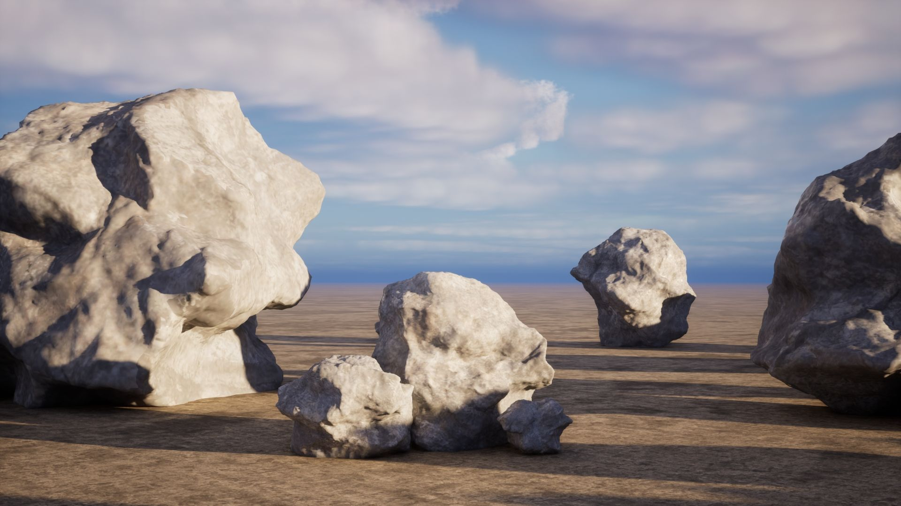
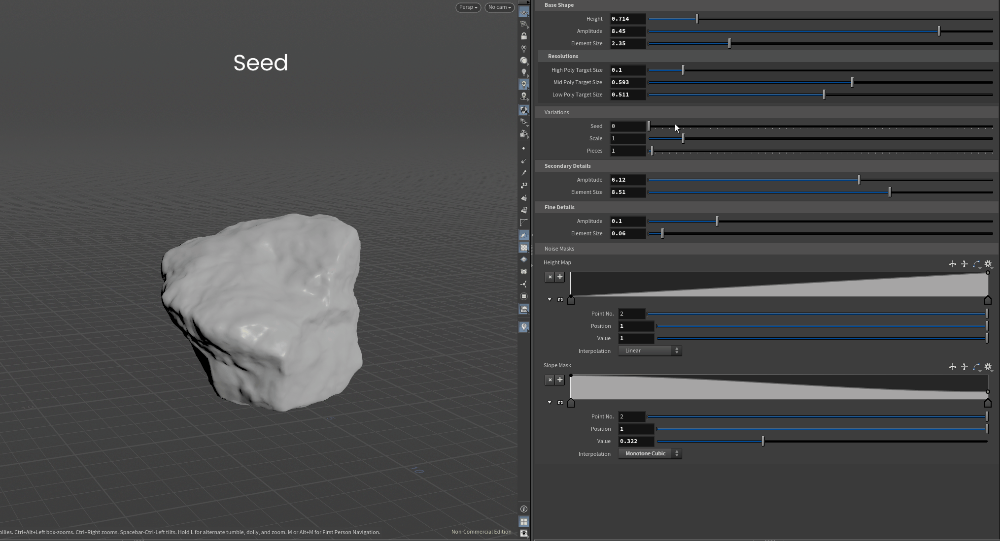

# Procedural Rock Generator

A Houdini Digital Asset (HDA) for generating procedural rock variations through a parameter-driven workflow.

The asset creates unique rock meshes using layered procedural noise, fracture processing, and procedural masking while giving artists full control over the overall rock shape.

---

## Preview

<p align="center">
  
</p>

<p align="center">
  
</p>

---

## Features

- Procedural rock generation
- Seed-based variations
- Layered noise workflow
- Height & slope mask controls
- Curve-based mask remapping
- Adjustable fracture generation
- Automatic UV generation (High Poly)
- Three output resolutions:
  - Low Poly
  - Mid Poly
  - High Poly

---

## Workflow

```
Base Shape
      ↓
Primary Noise
      ↓
Fracture
      ↓
Reconstruction
      ↓
Mask Generation
      ↓
Secondary Noise
      ↓
Detail Noise
      ↓
Mesh Outputs
```

---

## Installation

1. Download the `.hdanc` file.
2. In Houdini select:

```
Assets → Install Asset Library...
```

3. Choose the downloaded asset.
4. Click **Install**.

---

## Requirements

- Houdini FX 20.0.547
- Houdini Apprentice or higher

> **Note:** This asset was created using **Houdini Apprentice** and is distributed as a **non-commercial (.hdanc)** asset. Opening or saving commercial Houdini projects with this asset may convert them to non-commercial.

---

## Quick Start

1. Create the HDA inside a Geometry network.
2. Adjust **Height** and **Primary Noise**.
3. Change the **Seed** to generate new rocks.
4. Export one of the available outputs:
   - Low Poly
   - Mid Poly
   - High Poly

---

## Documentation

Complete documentation is available here:

**Documentation/Rock_Generator_Documentation.md**

---

## Unreal Engine

The generated meshes can be exported as FBX and imported into Unreal Engine as Static Meshes.

- Nanite compatible
- Collision should be generated inside Unreal Engine
- LODs are not generated automatically

---

## Roadmap

Planned features:

- Automatic LOD generation
- Collision generation
- Material presets
- Biome presets
- Nanite optimization

---

## License

This project is released for **non-commercial, educational, and personal use**.

The asset is distributed as a **.hdanc** file created with **Houdini Apprentice**.

---

## Author

**Mina D.**
