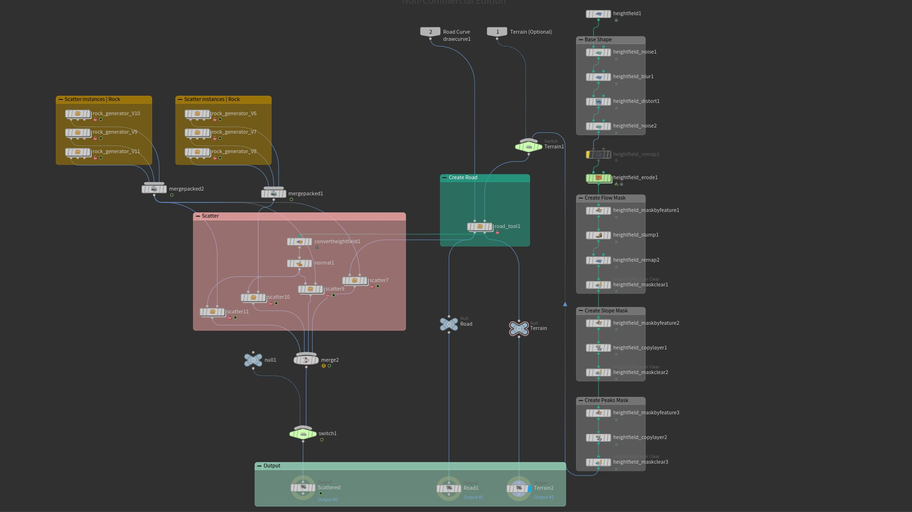
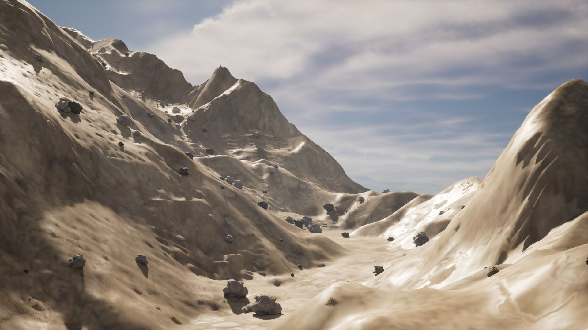
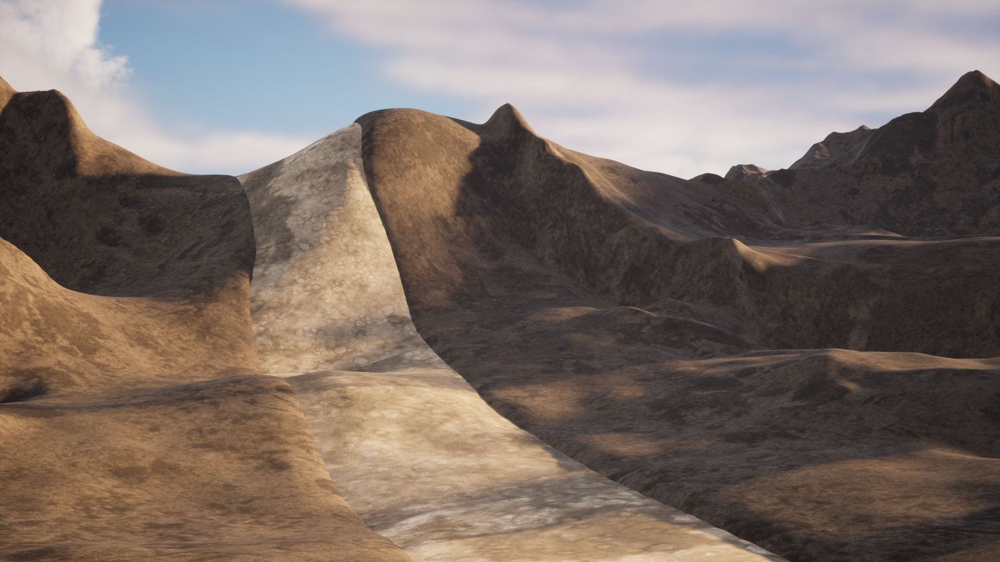
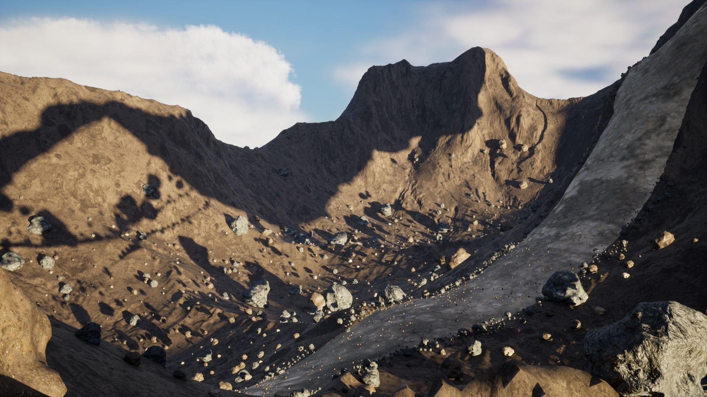

# Procedural Mini Environment Tools

A collection of procedural environment tools and experiments developed in Houdini as part of my learning path toward technical environment design.

The repository explores procedural modeling, attribute-driven workflows, surface distribution, curve-based generation, and the integration of individual tools into a small procedural environment.



## Projects

### Rock Generator

A procedural rock generation tool focused on controllable shape variation and layered noise deformation.

**Main topics:**

- Procedural shape generation
- Layered noise
- Attribute-driven deformation
- Seed-based variation
- HDA parameterization

[View Rock Generator](./Rock-Generator)


---

### Surface Scatter

A procedural surface scattering tool designed to distribute geometry based on surface properties and user-defined controls.

**Main topics:**

- Point generation
- Density control
- Attribute-driven distribution
- Scale and orientation variation
- Surface-aware scattering

[View Surface Scatter](./Surface-Scatter)




---

### Curved Base Road

A curve-based procedural road tool for generating road geometry from user-defined curves.

**Main topics:**

- Curve processing
- Resampling
- Width control
- Curve-based geometry generation
- Terrain interaction

[View Curved Base Road](./Curved-Base-Road)




---

### Mini Environment

A small procedural environment created by combining the tools above into a shared workflow.

The purpose of this project is to explore how individual procedural tools can work together as part of a larger environment-generation system.

**Main topics:**

- Tool integration
- Attribute flow
- Procedural relationships
- Environment assembly
- Reusable workflows

[View Mini Environment](./Mini-Environment)



---

## Learning Focus

This repository was developed as a practical learning project rather than as a collection of isolated tutorials.

The main areas explored throughout the projects are:

- Procedural modeling
- Houdini Digital Assets (HDA)
- Attribute-driven systems
- VEX fundamentals
- Procedural environment workflows
- Tool design and parameterization
- System integration

The projects increase gradually in complexity, moving from isolated procedural tools toward a small integrated environment system.

## Workflow

The general progression of the repository is:

```text
Procedural Asset Generation
          ↓
Surface Distribution
          ↓
Curve-Based Generation
          ↓
Tool Integration
          ↓
Mini Procedural Environment
```

## Software

- Houdini 20.0.547
- Unreal Engine 5.2.1 — used for integration testing where applicable

## Project Status

The tools in this repository were developed as part of an ongoing learning process.

Some features and integrations are still being refined as part of future iterations.

## License

These tools are provided for non-commercial, educational, and personal use.

Please refer to the individual project documentation for additional information.

## About

This repository documents an early stage of my journey toward becoming a Technical Environment Artist, with a focus on procedural design, Houdini, Unreal Engine, and scalable environment systems.
